# How to use mTCTScan?
For the webserver visit [mTCTScan]().
***

## Job submission

### Input profile
Input cancer mutation profile, we currently support VCF file for hg19/grch37  
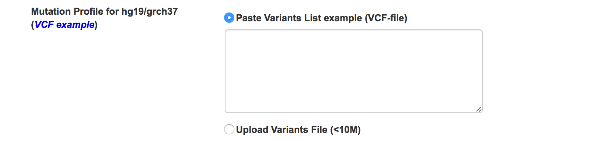

### Mutation filtering
#### General parameters
Define the filtering parameters for **cancer type**, **gene panel** and **allele frequency**. Two allele frequency database are supported including 1000 Genomes project phase 3 and ExAC  
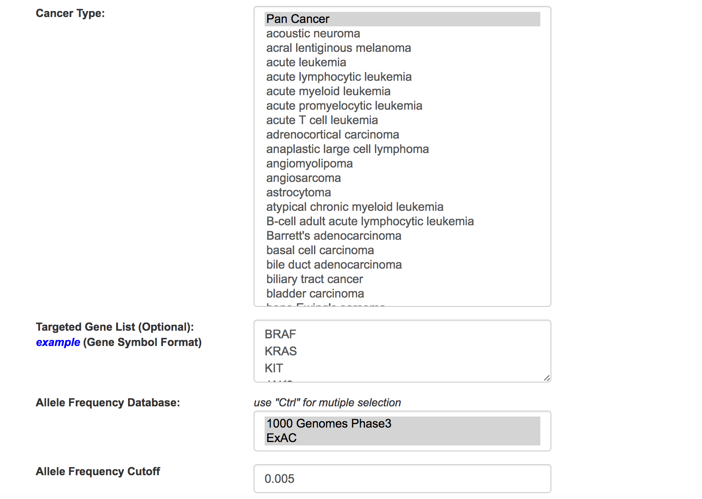

#### SnpEff parameters
We used SnpEff to annotate cancer mutations, and users can select and filter the undesired variant features  
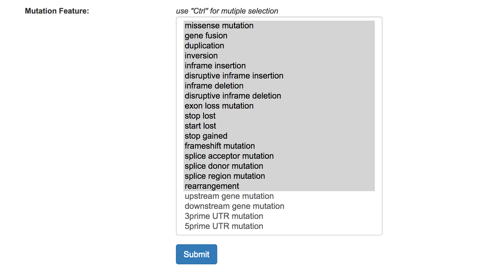 
***

## Job tracking

mTCTScan supports job retrieving from two manners

### Fixed job URL  
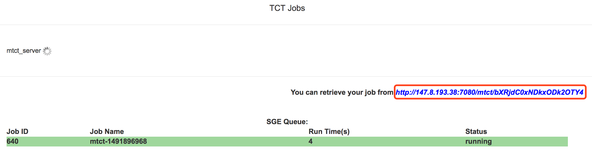

### Browser cookies in the Job menu  
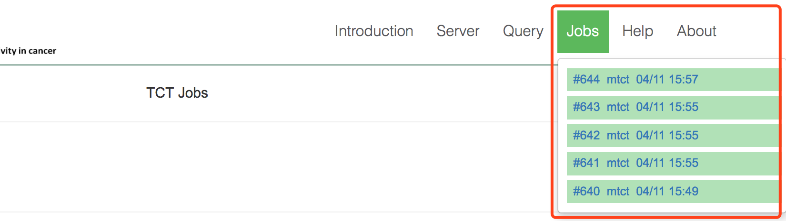
***

## Prioritization result

### Mutation prioritization

For each mutation at the transcript level, mTCTScan utilizes an evidence-based scoring strategy to prioritize the mutations associated with drug sensitivity. 

First, mTCTScan uses a series of matching strategies to connect each mutation-affected transcript to our collected mutation-cancer drug association records, including **Exact Match**, **Partial Match**, **Small-scale Overlap** and **Locus-based Overlap**.

* **Exact Match** requires that the genomic coordinates or protein effect of query mutations are exactly the same as our collected records
* **Partial Match** asks that protein effect of query mutation refers to same amino acid change with  collected records, or the genomic coordinates or protein effect of the query mutation exactly match one or part of the record’s mutations (some records require the concurrence of multiple mutations)
* **Small-scale Overlap** means that the genomic coordinates of query mutation overlaps with collected records at small insertions or deletions (Indel) scale
* **Locus-based Overlap** describes that the genomic coordinates of query mutation overlaps with collected records at structure variations scale. 
* In addition, mTCTScan would also search through cancer functional events and drug sensitivity associations which are from cell line data by matching query mutation to related cancer functional events. 

In order to retrieve all relevant evidences of different levels, mTCTScan would map every mutation to each of above categories. 

Second, each association record contains a confidence level with five grades including

* **Proven**
* **Clinical trial stage**
* **Case report stage**
* **Preclinical stage**
* **Inferential stage**

Then, for each mutation, by considering both the matching degree and the confidence level of association records, an evidence-based ensemble score would be calculated. According to this score, mTCTScan would rank all qualified mutations (mutations match with at least one record) in a table. User can click the **Details** button to get more information  
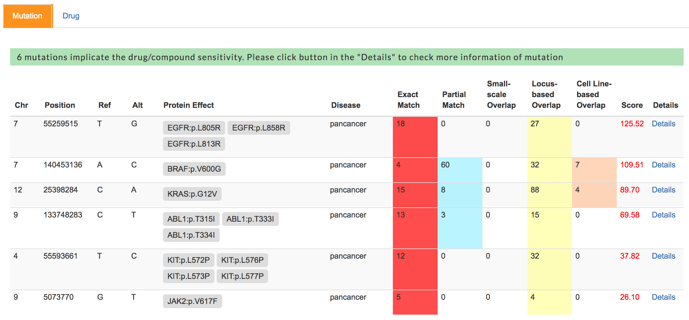

### Cancer drug classificaiton

For each drug/compound, mTCTScan would compare whether the mutations' impacts on drug sensitivity are consistent or conflicting across all associated mutations at the "Exact Match" and "Partial Match" levels. Based on the following criteria, drugs/compounds were divided into three categories

* **Increased Sensitivity** indicating that mutations consistently increase this drug’s sensitivity or response
* **Reduced Sensitivity** indicating that mutations consistently decrease this drug’s sensitivity or response
* **Conflicting Sensitivity** indicating that at least one mutation modulates sensitivity or response of this drug in an opposite direction comparing with others.

In addition, mTCTScan uses the number of associated mutations as the order to present drugs in each category.  
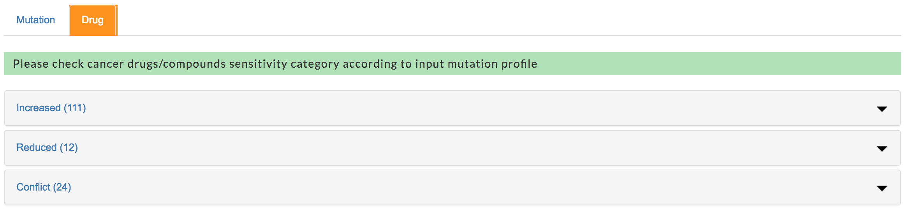

***

## Mutation annotations

mTCTScan reports all related mutation-affected gene transcripts.  
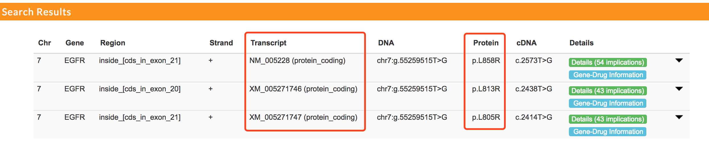

Users can click each mutation record to expand the annotation panel.  
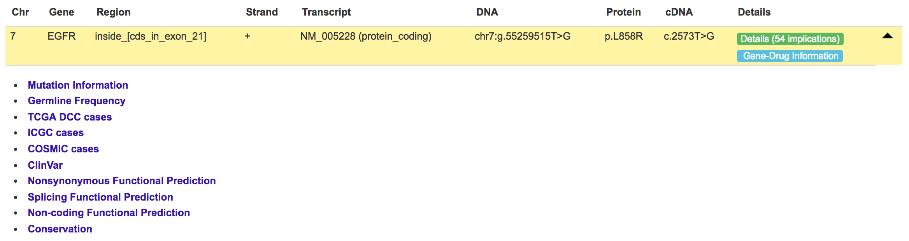

Eleven different annotation fields are provided, which include basic **Mutation Information**, **Germline Allele Frequency** (from 1000 Genomes project, ExAC, UK10K, ESP project), somatic recurrence rate from **TCGAs**, **ICGC** and **COSMIC**, clinical associated mutations from **ClinVar**, functional predictions including **Nonsynonymous Functional Prediction**, **Splicing Functional Prediction** and **Non-coding Functional Prediction** and base-wise **Conservation**.

For example, user can click **ClinVar** item to inspect detailed information  
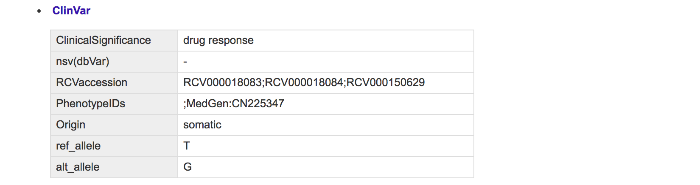
***

## Mutation-cancer drug association

### Association detail

For each mutation-affected transcript, user can check the **Details Implication** button to get all associated records  
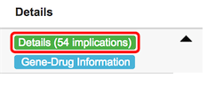

For each transcript, a **lollipop-style diagram** and tabs to display **different levels of matched evidences** are provided.

Moreover, for each association record, addition tabs are provided to display **Mutation Association Summary**, **Drug & Therapy Information** and **Clinical Trial Information** related to the drug.

#### Lollipop-style diagram

Lollipop-style mutation diagrams to visualize variant position in protein functional domain  
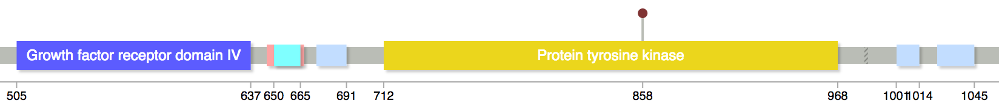

#### Different levels of matched evidences

For each query mutation, four levels of matching strategies were used to retrieve records from our database  
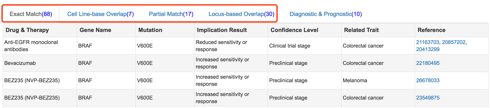

#### Mutation Association Summary  
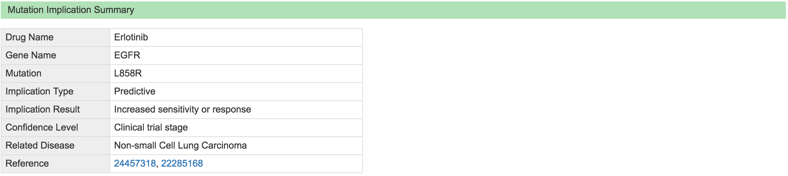

#### Drug & Therapy Information  
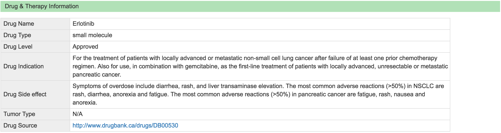

#### Clinical Trial Information  
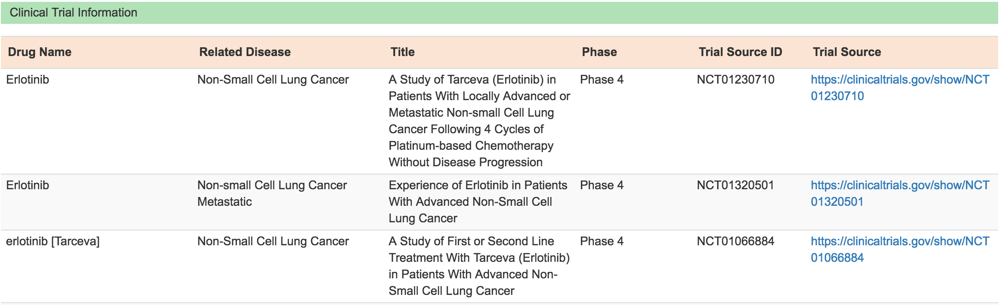

### Gene-Drug Information

For each mutation-affected transcript, mTCTScan also reports related drugs/compounds information based on the relationship between drugs and their gene targets. Also, clinical trial information related to these drugs are be provided.

#### Drug and therapy information
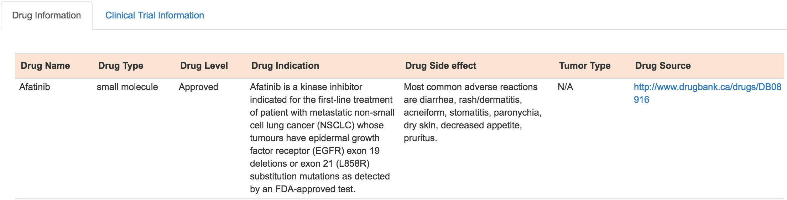

#### Clinical trial information
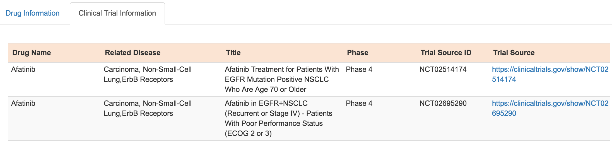
***

## Query by single mutation

mTCTScan also introduces a search engine for the query of associated drug response by a single mutation  
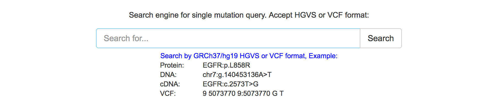

