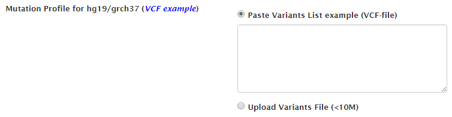

# mTCTScan
For full documentation visit [mkdocs.org](http://mkdocs.org).
## How to use mTCTScan Server?

***
## Job submission

1. Input cancer mutation profile, we currently support VCF file for hg19/grch37

2. Define the filtering parameters for cancer type, gene panel and allele frequency. Two allele frequency database are supported including 1000 Genomes project phase 3 and ExAC
3. We used SnpEff to annotate cancer mutations, and user can select and filter the undesired variant features

***
## Job tracking

mTCTScan supports job retrieving from two manners

### Use fixed job URL
### Use browser cookies in the Job menu

***
## Mutation Prioritization

mTCTScan utilizes an evidence-based scoring strategy to prioritize the mutations associated with drug sensitivity. Generally, we divided the evidences of mutations associated drug sensitivity into following four categories, including  

1. Altered Sensitivity [Hit]: The mutation exactly hits the known mutation that influences drug response
2. Cell Line Evidence: The gene in the mutation locus matches the significant gene-drug sensitivity in cell line level pharmacogenomics screens
3. Altered Sensitivity [Match]: The mutation matches the known mutations (like mutation combination, or degenerative sequence) that associates drug response
4. Altered Sensitivity [Overlap]: The mutation overlaps the known mutations (like large mutations, or structural variants) that associates drug response

According to the importance of evidences, mTCTScan rank the qualified mutations in a table. User can click the "Details" to check more information:

***
## Mutation annotations

mTCTScan reports all related mutation-affected gene transcripts:

User can click each mutation record to expand the annotation panel.

Eleven different annotation fields are provided, which include basic mutation information, germline allele frequency (from 1000 Genomes project, ExAC, UK10K, ESP project), somatic recurrence rate from TCGA, ICGC and COSMIC, clinical associated mutation from ClinVar, functional predictions (nonsynonymous, splicing and non-coding functional prediction) and base-wise conservation.

For example, user can click "ClinVar" or "Nonsynonymous Functional Prediction" item to inspect detailed information:

***
## Mutation-dependent drug response

### Details Implication

For each mutation-affected transcript, user can check the "Details Implication" button to get the mutation-dependent drug sensitivity information:

A series visualization functions to display mutation, drug sensitivity and drug information:

1. Lollipop-style mutation diagrams to visualize variant position in protein functional domain
2. Four level of evidences to show the mutation-dependent drug sensitivity
3. Mutation implication details and drug information from DrugBank and Clinic Trial
	* Mutation Implication Summary
	* Drug & Therapy Information
	* Clinical Trial Information

### Gene-Drug Information

For each mutation-affected transcript, user can also check the related drug/compound information in the gene level

1. Drug and therapy information
2. Clinical trial information

***
## Query by single mutation

mTCTScan also introduces a search engine for the query of associated drug response at single mutation

